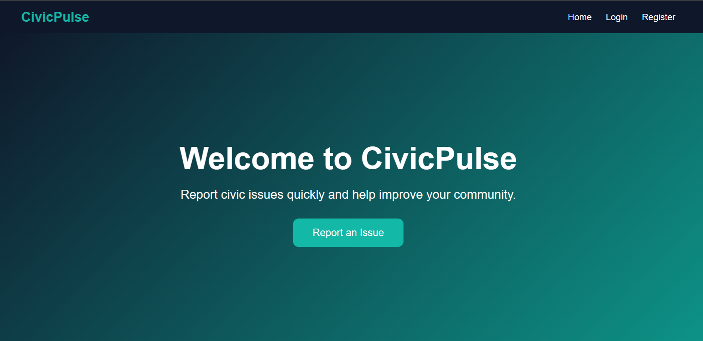
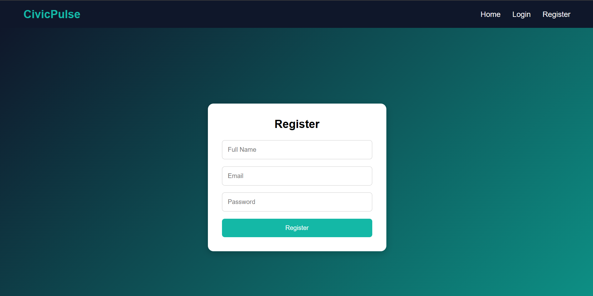
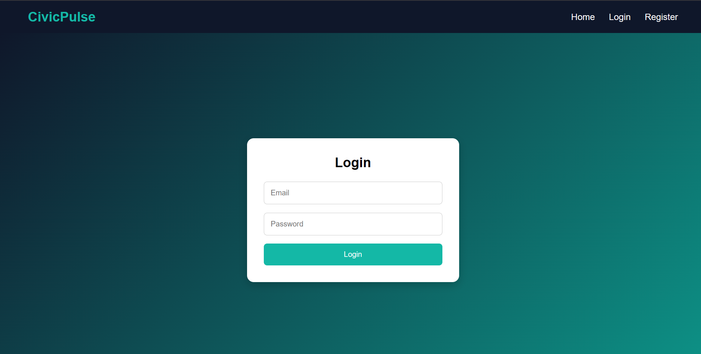

# 🏙️ CivicPulse – Smart Civic Issue Reporting Platform

## 📖 Project Overview

CivicPulse is a Full Stack Web Application that enables citizens to report and track civic issues such as potholes, garbage dumps, water leakage, and streetlight failures.

This project is being developed step by step using **React**, **Spring Boot**, and **MySQL**.

---

# 🚀 Current Status

## ✅ Milestone 1 & 2 Completed

The application currently supports:

- User Registration
- User Login
- React–Spring Boot Integration
- MySQL Database Connectivity
- Responsive Authentication UI

---

# 🗺️ Project Roadmap

## ✅ Milestone 1 – Backend Foundation
- Spring Boot Setup
- MySQL Integration
- User Registration API
- User Login API

## ✅ Milestone 2 – Frontend Foundation
- React Setup
- Authentication UI
- React Router
- Axios Integration

## 🔄 Milestone 3 – Core CivicPulse Features
- Report Issue
- View Issues
- Dashboard Statistics
- Dynamic Navbar
- Logout
- Route Protection

## ⏳ Milestone 4 – Advanced Features
- Spring Security
- JWT Authentication
- Role-Based Access
- Deployment

# 🎯 Objective

Develop a scalable civic issue reporting platform where users can:

- Register an account
- Login securely
- Report civic issues
- Track issue status
- View dashboard statistics

---

# 🛠️ Tech Stack

## Frontend

- React (Vite)
- React Router DOM
- Axios
- CSS

## Backend

- Java 17
- Spring Boot
- Spring Web
- Spring Data JPA

## Database

- MySQL

## Tools

- VS Code
- Eclipse IDE
- MySQL Workbench
- Postman
- Git
- GitHub

---

# 📂 Project Structure

```
CivicPulse_Project/
│
├── backend/
│
├── frontend/
│
├── exercises/
│
├── screenshots/
│
├── README.md
│
└── .gitignore
```

---

# ✅ Features Completed

## Authentication

### User Registration

- Register new users
- Validate user inputs
- Save user details in MySQL
- React form integrated with Spring Boot REST API

### User Login

- Login using email and password
- Validate user credentials
- Display success/error messages
- Navigate to Dashboard after successful login

---

# 🌐 REST API Endpoints

| Method | Endpoint | Description |
|---------|----------|-------------|
| POST | `/api/auth/register` | Register a new user |
| POST | `/api/auth/login` | Login user |

---

# 🗄️ Database

## User Table

| Field | Type |
|-------|------|
| id | Long |
| name | String |
| email | String |
| password | String |

---

# 🔄 Application Flow

```
React Frontend
      │
      ▼
Axios HTTP Request
      │
      ▼
Spring Boot REST API
      │
      ▼
Service Layer
      │
      ▼
Repository Layer
      │
      ▼
MySQL Database
      │
      ▼
Response
      │
      ▼
React UI
```

---

# 📈 Progress

## Backend

- ✅ Spring Boot Setup
- ✅ MySQL Configuration
- ✅ User Entity
- ✅ User Repository
- ✅ User Service
- ✅ Authentication Controller
- ✅ Register API
- ✅ Login API

## Frontend

- ✅ React Project Setup
- ✅ React Router
- ✅ Navbar
- ✅ Hero Section
- ✅ Features Section
- ✅ Footer
- ✅ Register Page
- ✅ Login Page
- ✅ Axios Integration

---

# 🎨 Theme

| Purpose | Color |
|----------|--------|
| Primary | #0F172A |
| Secondary | #0D9488 |
| Accent | #14B8A6 |
| Background | #F0FDFA |

---

# 📸 Screenshots

## Home Page


## Register Page


## Login Page


---

# 🚀 Upcoming Features

- Report Civic Issue
- View Reported Issues
- Dashboard Statistics
- Dynamic Navbar
- Logout
- Route Protection
- Spring Security
- JWT Authentication

---

## 👨‍💻 Author

**Abdul Majeed R**

GitHub: https://github.com/Abu1820

LinkedIn: https://www.linkedin.com/in/abdulmajeedr

# 📄 License

This project is for learning and portfolio purposes.

⭐ If you found this project interesting, feel free to star the repository.
